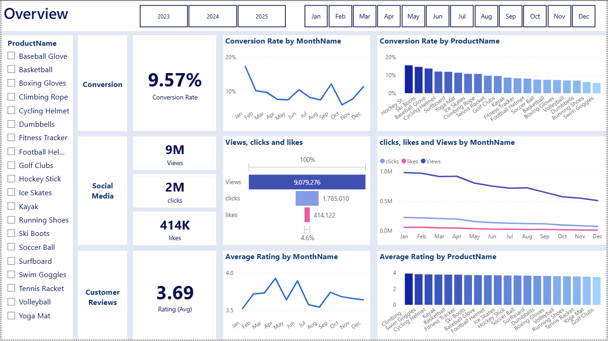
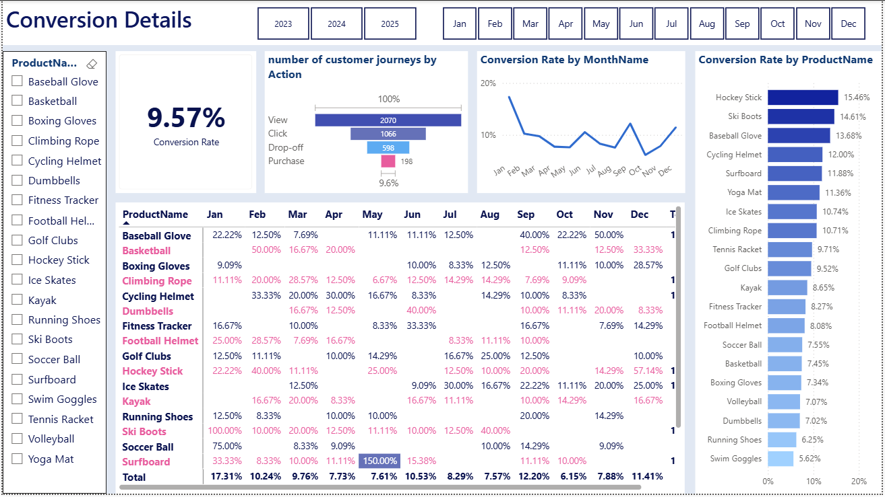
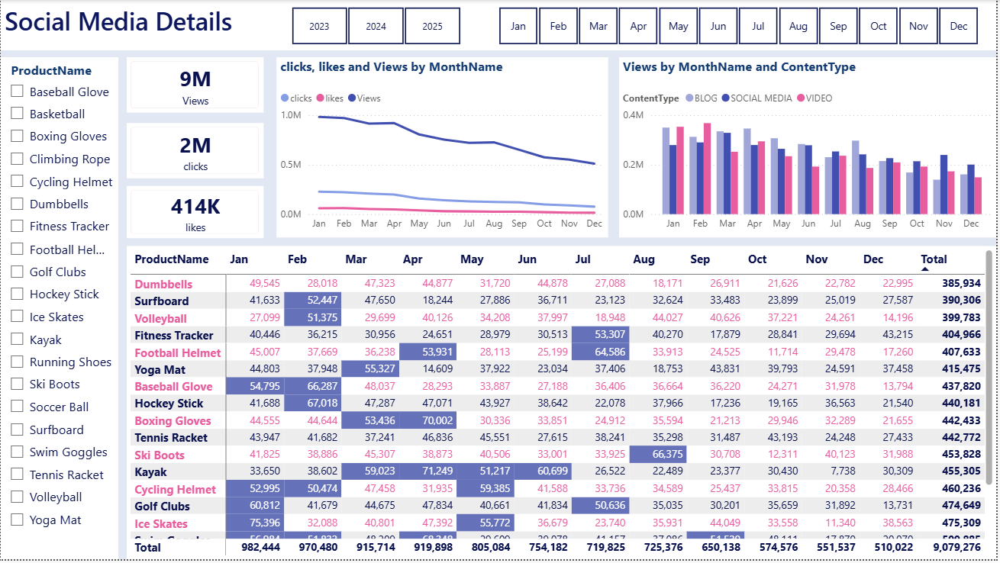
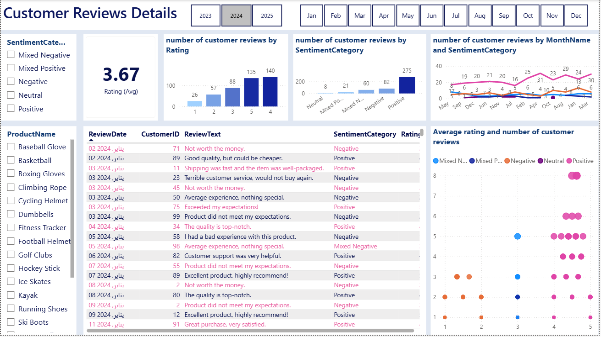

# Marketing Analytics Business Case

## Project Overview
A full-cycle marketing analytics solution built on customer journey, social engagement, and customer review data for an online retail business, covering conversion performance, content engagement, and customer sentiment across a full year.
The system was designed to answer real marketing questions — not just display numbers — by combining data cleaning and transformation in **SQL**, sentiment enrichment in **Python (NLTK)**, and executive-ready dashboards in **Power BI**.

---

## Dashboard Preview

### Page 1 — Overview


### Page 2 — Conversion Details


### Page 3 — Social Media Details


### Page 4 — Customer Reviews Details


---

## Key Business Questions Answered(For 2024 Year)

| Question | Answer |
|---|---|
| What's the overall conversion trend? | Rebounded to **10.2%** in December after a dip to 5.0% in October |
| Best converting month? | January — **18.5%**, driven by Ski Boots at 150% |
| Worst converting month? | May — **4.3%**, with no standout products |
| Is engagement growing or shrinking? | Declining — views trend down from August onward |
| Best-performing content type? | Blog content, especially in March and May |
| Click-through effectiveness? | **15.37%** click-through rate despite low click/like volume vs. views |
| Average customer rating? | **3.7** — stable, but below the 4.0 target |
| Sentiment split? | **275 positive** reviews vs. **82 negative**, with a smaller mixed/neutral segment |

---

## Business Insights

**Conversion is seasonal, not broken**
Conversion rates swung from a low of 4.3% in May to a high of 18.5% in January, with the year closing on a strong rebound to 10.2% in December after an October dip to 5.0%. The pattern points to seasonal demand and campaign timing as the biggest lever — not a fundamentally weak funnel.

**Engagement is declining, and content format matters**
Views peaked in February and July, then declined steadily from August onward — a clear sign of audience fatigue in the back half of the year. Clicks and likes stayed consistently low relative to views, but the 15.37% click-through rate shows that the audience that *does* engage, engages meaningfully. Blog content outperformed social and video content for driving views, meaning the fix is about format, not just frequency.

**Feedback is positive but plateaued**
Average ratings held steady around 3.7 all year — stable, but short of the 4.0 target. Sentiment analysis reinforced this: positive sentiment dominates (275 reviews) over negative (82), but the presence of mixed sentiment signals a real opportunity — converting borderline experiences into clearly positive ones is a more efficient path to the target than chasing entirely new customers.

---

## Architecture & Tech Stack

```
Raw Marketing Data (customer journey, engagement logs, reviews)
        ↓
   SQL (cleaning, joining, star-schema transformation)
        ↓
   Python (NLTK sentiment analysis on review text)
        ↓
   Power BI (data model, DAX measures, dashboard)
        ↓
   Executive Dashboard 
```

| Layer | Tool | Purpose |
|---|---|---|
| Data extraction & cleaning | SQL (SQL Server / SSMS) | Clean, join, and reshape raw tables into a star schema |
| Sentiment enrichment | Python (pandas, NLTK) | Score customer review text into sentiment categories |
| Modeling & visualization | Power BI (Power Query + DAX) | Build the data model, write measures, design the 4-page report |

---

## Challenges & Solutions

**Unstructured feedback data** — Star ratings alone couldn't explain *why* customers felt the way they did. Solved by running Python (NLTK) sentiment analysis on the raw review text, adding a sentiment category to every review before it reached Power BI.

**Fragmented raw tables** — Customer journey, engagement, and review data lived in separate, inconsistently structured tables. Solved with SQL transformations that cleaned and joined the sources into a proper fact/dimension star schema (`fact_customer_journey`, `fact_engagement_data`, `fact_customer_reviews_with_sentiment`, `dim_customers`, `dim_products`, `Calendar`) before loading into Power BI.

---

## Solutions

Each insight was paired with a concrete action for the marketing team:

**Increase Conversion Rates**
*Target High-Performing Product Categories* — Focus marketing efforts on products with demonstrated high conversion rates, such as Kayaks, Ski Boots, and Baseball Gloves. Implement seasonal promotions or personalized campaigns during peak months (e.g., January and September) to capitalize on these trends.

**Enhance Customer Engagement**
*Revitalize Content Strategy* — To turn around declining views and low interaction rates, experiment with more engaging content formats, such as interactive videos or user-generated content. Additionally, boost engagement by optimizing call-to-action placement in social media and blog content, particularly during historically lower-engagement months (September–December).

**Improve Customer Feedback Scores**
*Address Mixed and Negative Feedback* — Implement a feedback loop where mixed and negative reviews are analyzed to identify common issues. Develop improvement plans to address these concerns. Consider following up with dissatisfied customers to resolve issues and encourage re-rating, aiming to move average ratings closer to the 4.0 target.

---


## Skills Demonstrated

`SQL data cleaning & transformation` · `Star schema data modeling` · `Python (pandas, NLTK) sentiment analysis` · `DAX measures` · `Power BI report design` · `Stakeholder storytelling & business recommendations`

